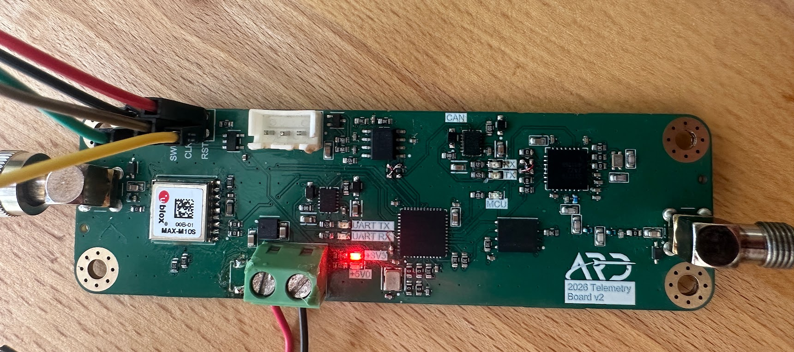

# Adept Rocketry Ground Station

GUI, groundstation, and telemetry board firmware for custom stm32-based PCB with GPS module and LoRa transceiver to send telemetry data to a ground station and display it on a GUI. 

## telemetry_board

`STM32L433CCUx` based firmware for the Telemetry Board. The board interfaces with an SX1276/7/8/9 LoRa transceiver to transmit telemetry data and maxM10s gps module to track position.

[Refer to the telemetry_board README](telemetry_board/README.md)

[Telemetry Board Schematic](telemetry_board/docs/2026%20Telemetry%20Board%20Schematic.pdf)

## Ground Station

ESP32-based receiver and forwarder.

[Refer to the ground_station README](ground_station/README.md)

## Graphical User Interface (GUI)

[Gui README](gui/README.md)

### Telemetry (Active)

### Telemetry (Inactive)

### GUI Graphs

### Settings (Placeholder Mock Data)

